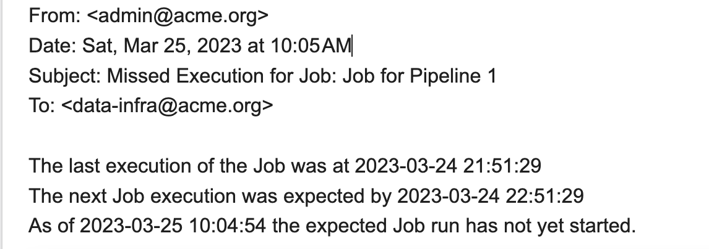

# streamsets-sdk-examples

This project includes an example of using the [StreamSets SDK for Python](https://docs.streamsets.com/sdk/latest/index.html) for StreamSets Control Hub 3.x

If you are using StreamSets DataOps Platform instead, use the examples [here](https://github.com/onefoursix/streamsets-dataops-sdk-examples) instead.

## Examples

<hr/>

### [notify-on-missed-execution.py](python/notify-on-missed-execution.py)

This example sends an email notification if a scheduled Job execution was missed

Prerequisites:

 - Python 3.6+

 - StreamSets SDK for Python v3.x
 
   See: https://docs.streamsets.com/sdk/latest/installation.html

 - Python v3.x pytz module
 
    <code>$ pip3  install pytz</code>

 - Control Hub login and password for a user with Organization Administrator role

 - An SMTP Server with a user login and password in order to send email notifications

 - Set the following variables in the script:
 
````
        job_id - the ID of the Job to be monitored
        job_expected_frequency_minutes - for example, if a Job is expected to run once a day, use a value of 24 * 60
        sdc_timezone - the timezone for the Data Collector where the Job runs, for example 'US/Pacific'
        smtp_host - the hostname of the SMTP server
        smtp_port - the SMTP port
        email_sender - the email "from" address
        email_recipient - the email "to" address
````

 - To avoid including credentials in the script, export these environment variables
   prior to running the script:
````
        export SCH_USER=<the Control Hub user>
        export SCH_PASSWORD=<the Control Hub password>
        export SMTP_USER=<the smtp user>
        export SMTP_PASSWORD=<the smtp password>
````

Here is example output for a run if the Job did execute at the expected time:

````
    $ python3 ./notify-on-missed-job-execution.py

    Geting status for Job 'Job for Pipeline 1' with Job ID '0d203283-ae50-40f4-b54f-ef8418dc9c79:schbrooks'
    Current job status is 'INACTIVE'
    The last Job run was at: 2023-03-25 10:14:04
    Next Job run expected before: 2023-03-26 10:14:04
    Current time: 2023-03-25 10:33:25
    Expected Job execution was not misssed; no notification was sent.
    Done
````

Here is example output for a run if the Job did not execute at the expected time:
````
    $ python3 ./notify-on-missed-job-execution.py

    Geting status for Job 'Job for Pipeline 1' with Job ID '0d203283-ae50-40f4-b54f-ef8418dc9c79:schbrooks'
    Current job status is 'INACTIVE'
    The last Job run was at: 2023-03-25 10:14:04
    Next Job run expected before: 2023-03-25 10:19:04
    Current time: 2023-03-25 10:55:03

    ===================================================++++=========
    MISSED EXECUTION!  The Job did not run within the expected time!
    ================================================================

    ================================================================
    Sending email:
    Subject: Missed Execution for Job: Job for Pipeline 1
    Message body:
    The last execution of the Job was at 2023-03-25 10:14:04
    The next Job execution was expected by 2023-03-25 10:19:04
    As of 2023-03-25 10:55:03 the expected Job run has not yet started.
    ================================================================
````

Here is an example email that was sent for the missed execution:




Additionally, if the Job is not in an INACTIVE state when the script runs, the following output is written:
````
    $ python3 ./notify-on-missed-job-execution.py

    Geting status for Job 'Job for Pipeline 1' with Job ID '0d203283-ae50-40f4-b54f-ef8418dc9c79:schbrooks'

    Current job status is 'INACTIVE_ERROR'

    ============================================================

    Sending email:
    Subject: Unexpected status for StreamSets Job: Job for Pipeline 1
    Message body: Unexpected status for StreamSets Job 'Job for Pipeline 1' with Job ID '0d203283-ae50-40f4-b54f-ef8418dc9c79:schbrooks'
    Expected Job status is 'INACTIVE'
    Actual Job status is 'INACTIVE_ERROR'

    ===========================================================
````
Here is an example email that was sent for the unexpected Job state:


<hr/>

